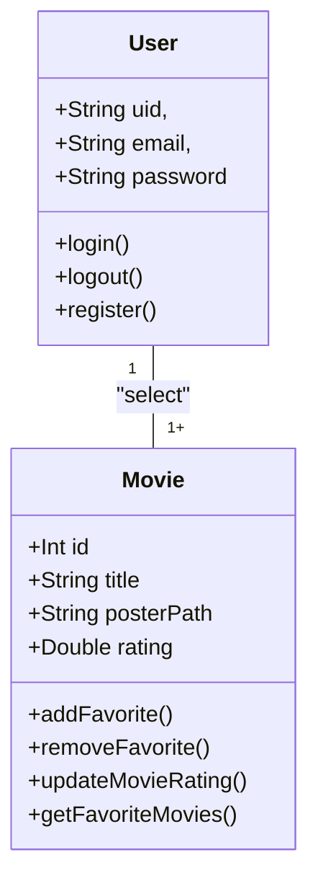
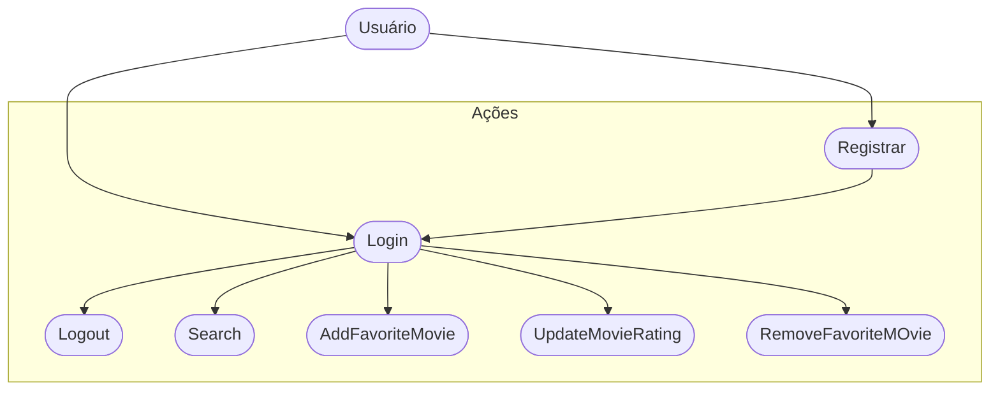

# CineFavorite (Formativa)

## Briefing 
Construir um Aplicativo do Zero - O CineFavorite que permitirá criar uma conta e buscar filmes em uma API, montar uma galeria pessoal de filmes favoritos, com poster(capa) e nota avaliativa do usuário para o filme.

## Objetivos
- Criar uma Galeria Personalizada po usuário de filmes favoritos
- Buscar filmes em uma API e listar para selecionar filmes favoritos
- Criação de contas por usuário
- Listar filmes por palavra-chave

## Levantamento de Requisitos
- ### Funcionais
- ### Não Funcionais

## Recursos do Projeto
- Linguagem de Programação: Flutter/Dart
- API TMDB: Base de Dados para filmes
- Figma: Prototipagem
- GitHub: Armazenamento e Versionamento do Código
- FireBase: Authentication /FireStore DB
- VSCode: Codificação 

## Diagramas
1. ### Classe;
Demonstrar o funcionamento das Entidades do Sistema
- Usuário (User): Classe já modelada pelo FireBaseAuth
    - Atributos: email, senha, uid
    - Métodos: login, registrar, logout

- Filmes Favoritos (Movie): Classe Modelada pelo DEV - Baseada na API TMDB
    - Atributos: id, titulo, POsterPath, Nota
    - Métodos: adicionar, remover, listar e atualizar nota (CRUD)



2. ### Casos de Uso
Ação que os atores podem fazer
- Usuário: 
    - Registrar
    - Login
    - Logout
    - Procurar Filmes na API
    - Salvar Filmes aos Favoritos
    - Dar nota aos filmes Favoritos
    - Remover Filmes dos Favoritos



3. ### Fluxo
Determinar o caminho Percorrido pelo Ator para executar uma ação.

- Fluxo da Ação de Login

```mermaid

    A[Início] --> B{Tela de Login}
    B --> C[Inserir Email e Senha]
    C --> D{Validar as Credenciais}
    D --> Sim --> E[Favorite View]
    D --> Não --> B

```

## Prototipagem 

https://www.figma.com/design/HJ2FoDtjcsnrbyovirLcQV/CineFavorite---Prot%C3%B3tipo-M%C3%A9dia-Fidelidade?node-id=0-1&t=isx4SwtHXUK4nzhW-1
